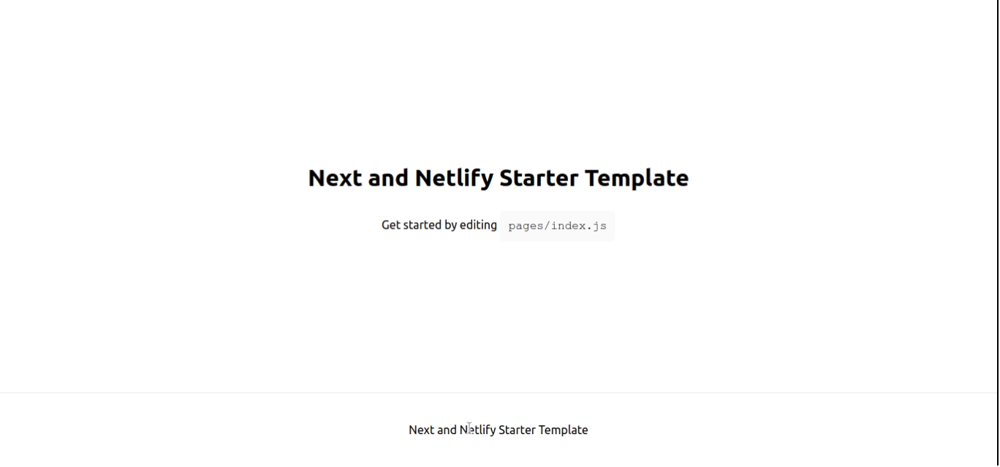

# Next Netlify Starter

[](https://app.netlify.com/start/deploy?repository=https://github.com/ChrisAchinga/next-netlify-starter)

[](https://app.netlify.com/sites/netlify-next-starter/deploys)



### Using the Repo:

Install dependencies:

```shell
npm install
```

Run development Server:

```shell
npm run dev
```